# Logistic Platform

Российская логистическая платформа для fixed-price биржи грузов. Заказчик публикует груз с заранее заданной ценой, перевозчики оставляют отклики без торгов, заказчик выбирает одного исполнителя, а дальше рейс ведется через договор, статусы доставки, фото, уведомления, маршрут и QR/код подтверждения.

Платформа не принимает оплату за перевозку и не становится стороной договора. Ее зона ответственности: публикация заявок, отклики, проверка профилей, карта, подбор перевозчиков, фиксация выбора, договорная фиксация, маршрутизация, уведомления и подтверждение завершения перевозки.

## Содержание

- [Скриншоты](#скриншоты)
- [Роли и доступ](#роли-и-доступ)
- [Бизнес-процессы](#бизнес-процессы)
- [Функциональные блоки](#функциональные-блоки)
- [Техническая архитектура](#техническая-архитектура)
- [Быстрый запуск](#быстрый-запуск)
- [Тестовые аккаунты](#тестовые-аккаунты)
- [Основные URL](#основные-url)
- [Переменные окружения](#переменные-окружения)
- [Команды и проверки](#команды-и-проверки)
- [Документы](#документы)

## Скриншоты

### Роли

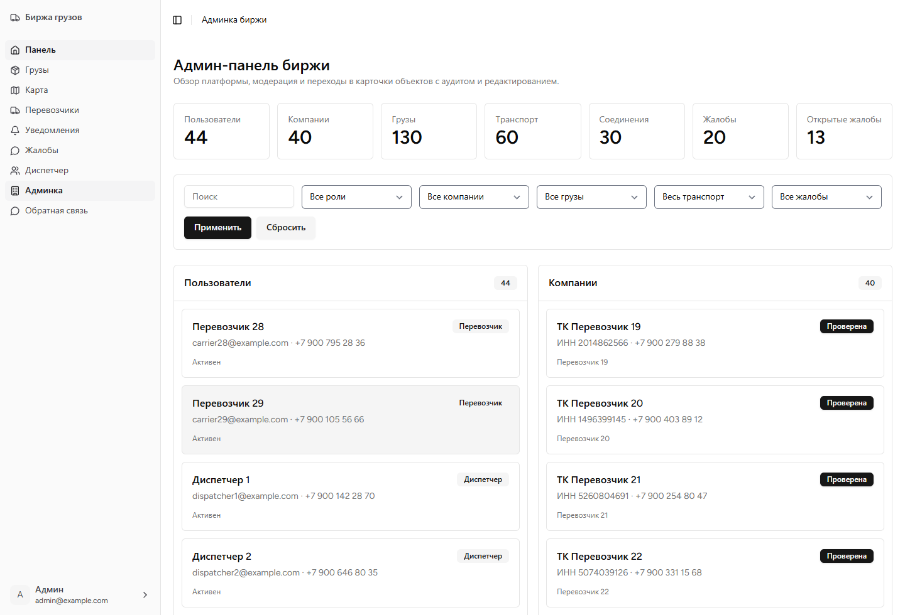

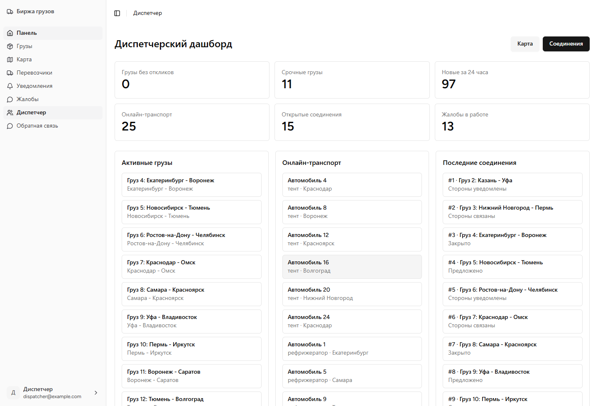

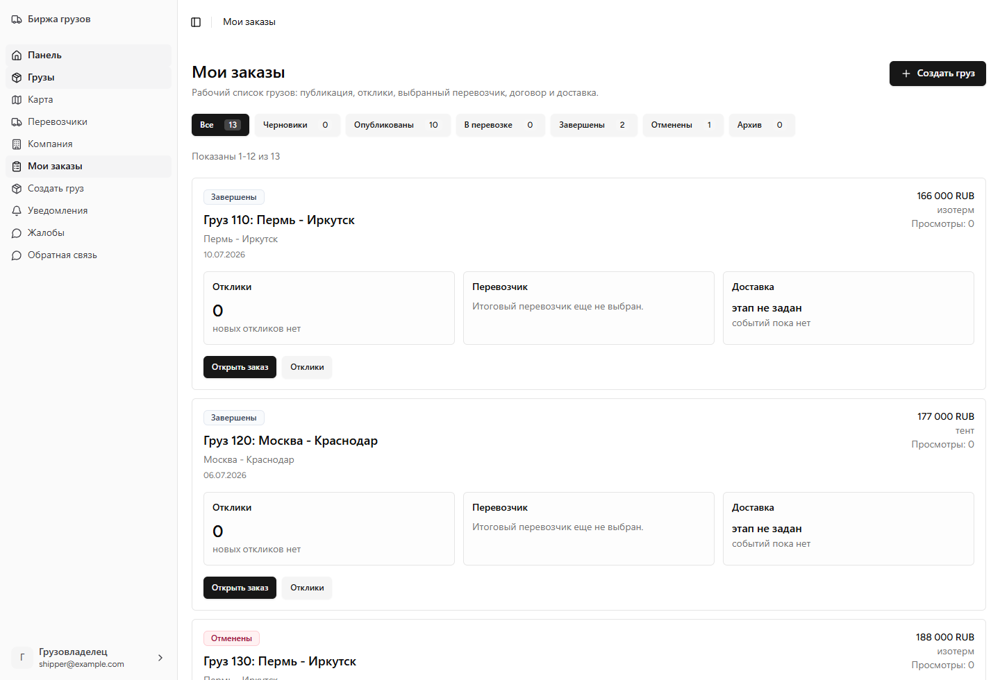

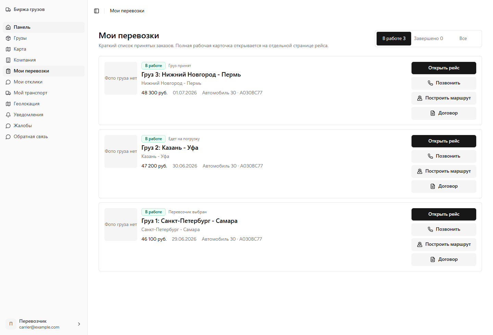

### Карта и карточки

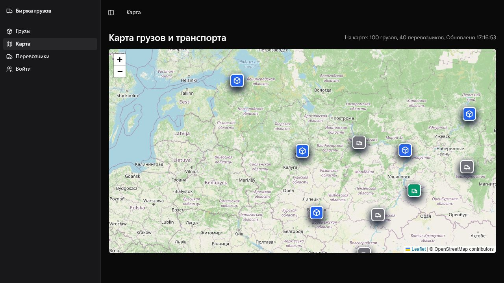

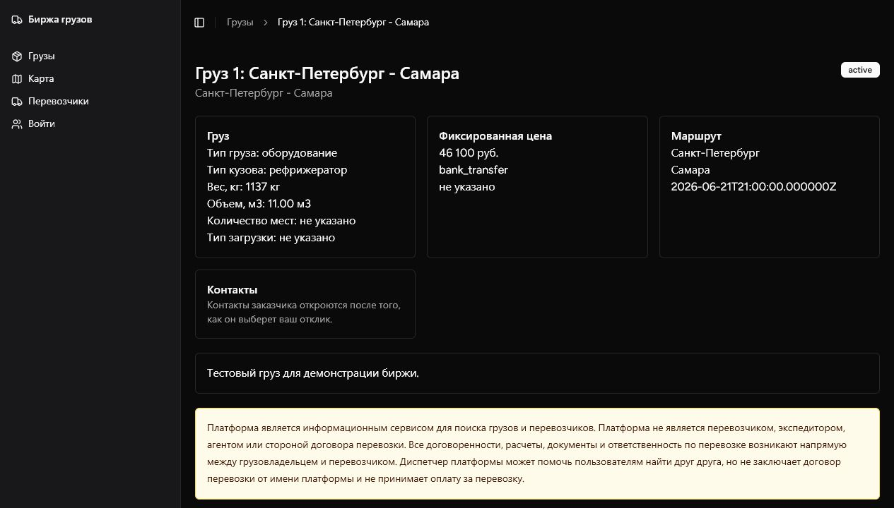

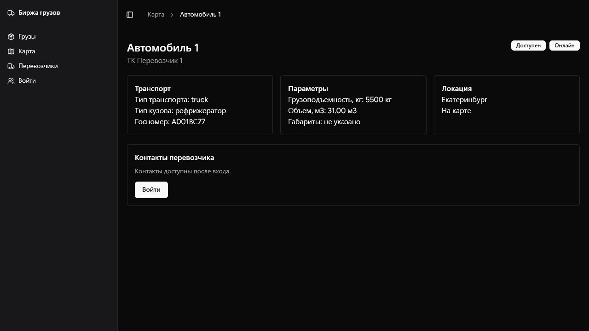

## Роли и доступ

Публичная регистрация открыта для `shipper` и `carrier`. Диспетчер и администратор создаются сидером или через административный контур.

| Роль | Что видит | Что делает |
| --- | --- | --- |
| `shipper` | Свои грузы, отклики по ним, выбранного перевозчика, договор, страницу доставки, уведомления, жалобы, публичные каталоги и карту | Создает и редактирует грузы, публикует и отменяет заявки, выбирает итоговый отклик, подписывает договор чекбоксом, подтверждает доставку QR/кодом |
| `carrier` - индивидуальный | Доступные грузы, свои отклики, свои рейсы, свой транспорт, карту, маршрут до принятого груза | Создает транспорт, откликается на грузы, принимает договор, ведет этапы рейса, обновляет геолокацию, загружает фото транспорта и контрольные фото груза |
| `carrier` - компания | Автопарк, водителей, отклики компании, рейсы компании, маршруты и договоры | Владелец/менеджер управляет машинами и откликами; назначенный водитель ведет этапы доставки и контрольные фото |
| `dispatcher` | Активные грузы, доступный транспорт, карту, скоринг ближайших перевозчиков, соединения сторон, уведомления | Подбирает перевозчиков, создает ручные соединения, отслеживает связь соединения с реальным откликом |
| `admin` | Пользователей, компании, грузы, транспорт, жалобы, диспетчерские соединения и аудит | Модерирует платформу, редактирует данные перевозчиков, компаний, грузов и транспорта, управляет статусами и жалобами |

### Диаграмма ролей

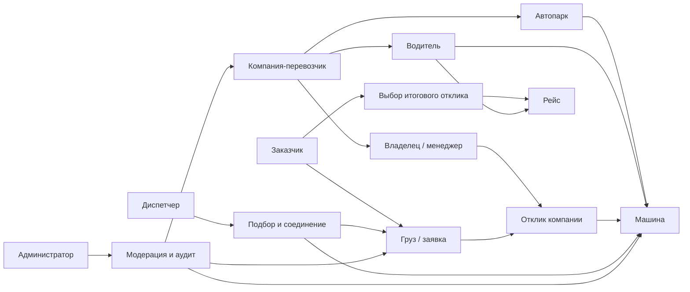

## Бизнес-процессы

### Основной процесс груза

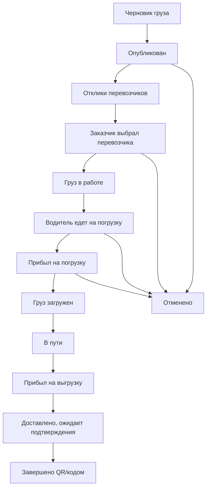

Ключевые ограничения:

- цена задается заказчиком, торгов и ставок нет;
- по одному грузу может быть несколько откликов, но выбран только один итоговый перевозчик;
- у одной компании-перевозчика может быть только один активный отклик на конкретный груз;
- водитель компании не создает отклик от имени автопарка, он исполняет назначенный рейс;
- контакты заказчика открываются только выбранному перевозчику после принятия отклика;
- публичные карточки транспорта отдают гостям только безопасный whitelist полей, без телефонов, email и точных координат;
- активный груз скрывается с публичной карты после выбора перевозчика;
- завершение возможно только после этапа `delivered_pending_confirmation`;
- отмена груза в работе возможна только до фактической погрузки;
- выбранная машина резервируется на время рейса и освобождается после отмены или завершения.

### Процесс отклика

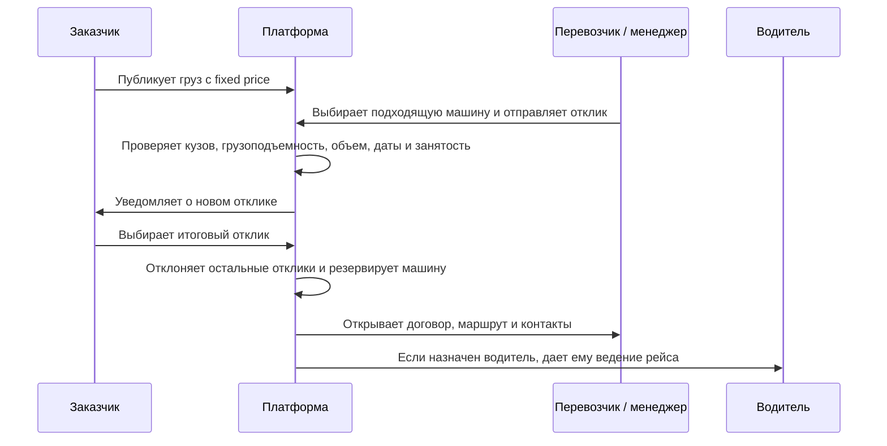

### Процесс доставки

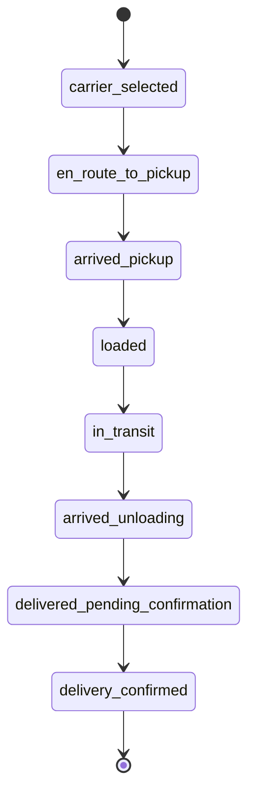

## Функциональные блоки

### Грузы и заказы

- создание груза с городами, адресами, координатами, датами, fixed price, весом, объемом, типом кузова, требованиями, фото и контактами;
- публикация, редактирование, отмена и завершение груза;
- карточка груза с вложенными секциями: маршрут, отклики, договор, доставка, события, фото и QR/код;
- отдельные страницы заказчика: список грузов, отклики по грузу, исполнение доставки.

### Отклики

- отклик создается только перевозчиком или менеджером компании-перевозчика;
- отклик требует выбор конкретной машины;
- машина проверяется по требованиям груза и активной занятости;
- водитель компании не может откликаться от имени компании;
- один активный отклик на груз для одной компании-перевозчика;
- остальные ожидающие отклики автоматически отклоняются после выбора победителя.

### Перевозчики, компании и водители

- перевозчик может быть индивидуальным или компанией;
- компания может добавлять зарегистрированных перевозчиков в команду;
- компания управляет несколькими машинами и назначает водителей;
- владелец и менеджер видят рейсы компании, но этапы доставки ведет назначенный водитель;
- если водитель не назначен, рейс ведет сам перевозчик-владелец отклика.

### Транспорт

- создание и редактирование транспорта;
- тип кузова, грузоподъемность, объем, габариты, даты доступности, региональные предпочтения;
- фото транспорта;
- проверка госномера и контактных данных;
- публичный каталог и карточка транспорта формируются через серверный DTO: контакты и точная геолокация не попадают в Inertia props без разрешенного доступа;
- управление видимостью на карте, геолокацией и online/offline-статусом.

### Карта и маршруты

- карта на Leaflet без стандартного префикса Leaflet в атрибуции;
- открытые XYZ-тайлы через `OPEN_MAP_TILE_URL`;
- разные иконки для грузов и транспорта;
- активные грузы видны до выбора итогового перевозчика;
- взятый в перевозку груз не отображается на публичной карте;
- переход с объекта карты в карточку груза или транспорта;
- маршрут выбранного перевозчика до точки погрузки через OSRM;
- маршрут доступен владельцу, менеджеру компании и назначенному водителю только по своему принятому рейсу.

### Геокодинг

Yandex Maps, Yandex Geocoder, Suggest API и Routing API Яндекса не используются.

Поддерживаются открытые варианты:

- `photon` - подсказки и геокодинг через Photon;
- `nominatim` - прямой геокодинг через Nominatim;
- `dictionary` - встроенный словарь крупных городов РФ как fallback.

Для production рекомендуется использовать собственные Photon/Nominatim/OSRM endpoints или совместимые сервисы с понятными лимитами.

### Договоры, фото и QR

- при регистрации пользователь принимает обязательные соглашения;
- отклик требует чекбокс принятия условий договора перевозки;
- при выборе итогового перевозчика фиксируется подпись/акцепт заказчика;
- договор доступен на `/loads/{id}/contract`;
- PDF договора доступен на `/loads/{id}/contract/download`;
- фото груза, транспорта и контрольные фото перевозчика хранятся на Laravel `public` disk;
- база хранит путь и JSON-метаданные, а не бинарные файлы;
- контрольное фото перевозчика по отклику показывается заказчику только после выбора этого отклика итоговым;
- QR/код подтверждения доставки доступен заказчику, выбранному перевозчику, диспетчеру и администратору.

### Уведомления и жалобы

- уведомления создаются по бизнес-событиям: отклик, выбор перевозчика, отклонение, смена этапа, жалоба, диспетчерское соединение;
- уведомления ведут в нужные карточки и рабочие страницы;
- поддержаны массовое прочтение и прочтение отдельных уведомлений;
- жалобы доступны участникам процесса, диспетчеру и администратору;
- история жалоб показывает бизнес-контекст: груз, цель жалобы, связанный отклик или диспетчерское соединение;
- администратор управляет статусами жалоб.

### Адаптив

- интерфейс построен на responsive layout;
- ключевые страницы водителя доступны с телефона: мои перевозки, карточка рейса, геолокация, маршрут, звонок заказчику, этапы доставки, фото;
- кнопка геолокации показывается только пользователю, который реально может обновлять координаты конкретной машины: владельцу индивидуального транспорта или назначенному водителю;
- списки ведут в отдельные детальные страницы, чтобы не раскрывать весь заказ одной длинной карточкой.

## Техническая архитектура

### Стек

- Laravel 12, Inertia.js, React 18, TypeScript;
- Tailwind CSS, Radix UI, lucide-react;
- SQLite для локального демо-запуска;
- Leaflet для карты;
- Photon/Nominatim/dictionary для геокодинга;
- OSRM для маршрутов;
- Laravel public disk для медиа;
- Playwright как dev-инструмент для воспроизводимых скриншотов README.

### Высокоуровневая схема

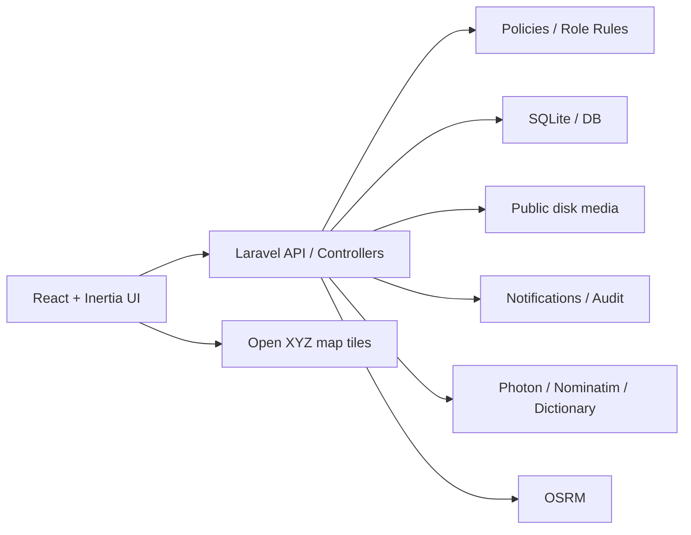

### Основные доменные сущности

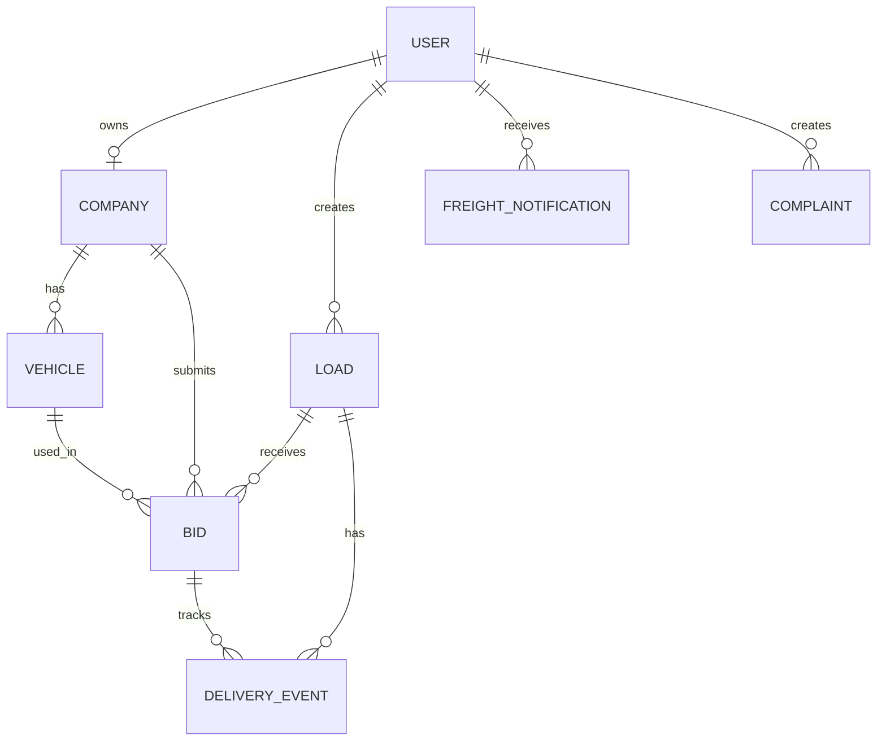

## Быстрый запуск

На Windows основной локальный режим использует Docker volume вместо медленного bind mount.

```powershell
npm install
powershell -ExecutionPolicy Bypass -File scripts/dev-runtime.ps1 -Fresh -Seed -BuildAssets
```

После запуска приложение доступно на [http://127.0.0.1:8010](http://127.0.0.1:8010).

Повторный запуск без очистки демо-БД:

```powershell
npm run dev:runtime
```

Fresh-режим нужен после миграций или если страницы возвращают `404`, `no such table`, старые ассеты или старые env-настройки. Он пересобирает assets, очищает runtime volume, прогоняет миграции и сидер.

## Тестовые аккаунты

После миграций и сидера:

| Роль | Email | Пароль | Стартовая страница |
| --- | --- | --- | --- |
| Администратор | admin@example.com | password | `/admin/freight` |
| Диспетчер | dispatcher@example.com | password | `/dispatcher` |
| Заказчик | shipper@example.com | password | `/my-loads` |
| Перевозчик | carrier@example.com | password | `/my-deliveries` |

## Основные URL

| URL | Назначение |
| --- | --- |
| `/register` | Регистрация |
| `/company` | Профиль компании |
| `/loads` | Публичный каталог грузов |
| `/loads/create` | Создание груза заказчиком |
| `/loads/{id}` | Карточка груза |
| `/loads/{id}/edit` | Редактирование груза |
| `/loads/{id}/contract` | Просмотр договора |
| `/my-loads` | Заказы заказчика |
| `/my-loads/{id}/bids` | Отклики по заказу |
| `/my-loads/{id}/delivery` | Исполнение заказа и подтверждение доставки |
| `/my-bids` | Отклики перевозчика |
| `/my-deliveries` | Перевозки перевозчика |
| `/my-deliveries/{bid}` | Карточка рейса |
| `/my-vehicles` | Транспорт перевозчика |
| `/vehicles` | Публичный каталог транспорта |
| `/vehicles/{id}` | Карточка транспорта |
| `/carrier/location` | Геолокация перевозчика |
| `/map` | Карта |
| `/notifications` | Уведомления |
| `/complaints` | Жалобы |
| `/dispatcher` | Кабинет диспетчера |
| `/dispatcher/loads/{id}/nearest-carriers` | Подбор ближайших перевозчиков |
| `/dispatcher/connections` | Диспетчерские соединения |
| `/admin/freight` | Админка биржи |
| `/legal/disclaimer`, `/legal/terms` | Юридические страницы |

## Переменные окружения

```env
APP_NAME="Logistic Platform"
APP_TIMEZONE=Europe/Moscow

MAP_PROVIDER=openstreetmap
OPEN_MAP_TILE_URL=https://{s}.tile.openstreetmap.org/{z}/{x}/{y}.png
OPEN_MAP_ATTRIBUTION="OpenStreetMap"

GEOCODING_PROVIDER=photon
PHOTON_BASE_URL=https://photon.komoot.io
NOMINATIM_BASE_URL=https://nominatim.openstreetmap.org
OSRM_BASE_URL=https://router.project-osrm.org

LOCATION_UPDATE_INTERVAL_SECONDS=30
VEHICLE_ONLINE_TIMEOUT_MINUTES=5
MAP_OBJECTS_REFRESH_SECONDS=20
FILESYSTEM_DISK=public
VALID_PHONE_COUNTRIES=RU
```

## Команды и проверки

Локально:

```bash
php artisan migrate --seed
php artisan db:seed --class=FreightExchangeSeeder
php artisan vehicles:mark-offline
php artisan location-pings:prune
npm run build
php artisan test
```

В Docker runtime:

```powershell
docker exec -w /app freight-exchange-app php artisan test tests/Feature/FreightExchangeTest.php
docker exec -w /app freight-exchange-app php artisan test tests/Feature/FreightExchangeTest.php tests/Feature/Auth tests/Feature/ProfileTest.php tests/Unit/FreightServicesTest.php tests/Unit/GeocodingServiceTest.php
npm.cmd run build
```

Текущий статус проверок:

- `npm.cmd run build`: успешно в локальной среде разработки;
- `git diff --check`: успешно;
- backend-тесты запускаются командами выше в Docker/runtime окружении; в текущей Windows-сессии Codex они не запускались, потому что локальный `php` не найден, а Docker engine недоступен.

Скриншоты README можно переснять через Playwright и системный Chrome. Текущие файлы лежат в `docs/screenshots`.

## Документы

- [Бизнес-план для инвесторов](docs/investor_business_plan.md)
- [Локальный runtime на Windows](docs/local_runtime_windows.md)
- [Хранение медиафайлов](docs/media_storage.md)
